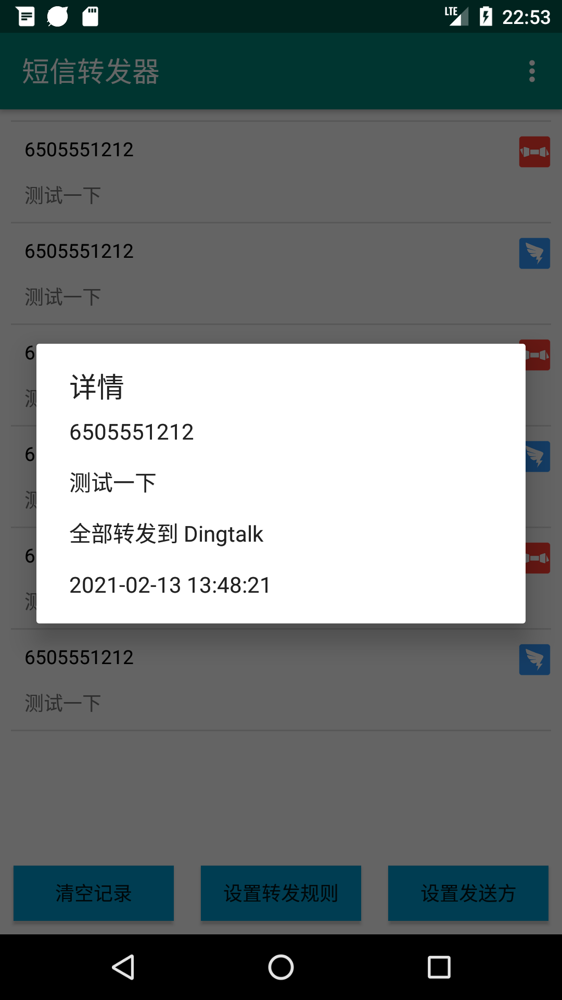
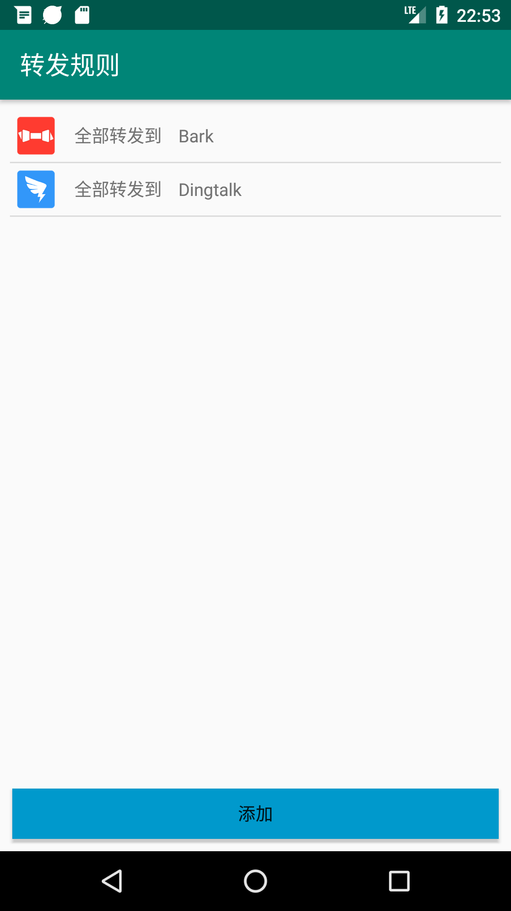
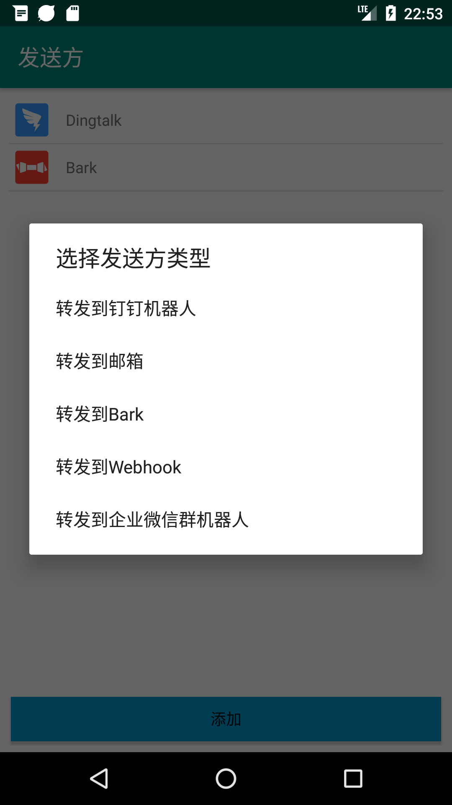
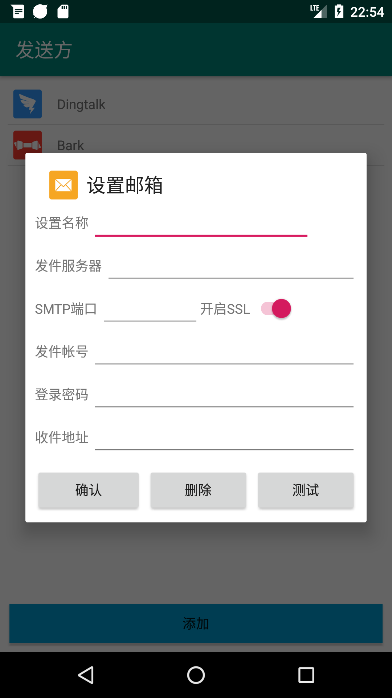
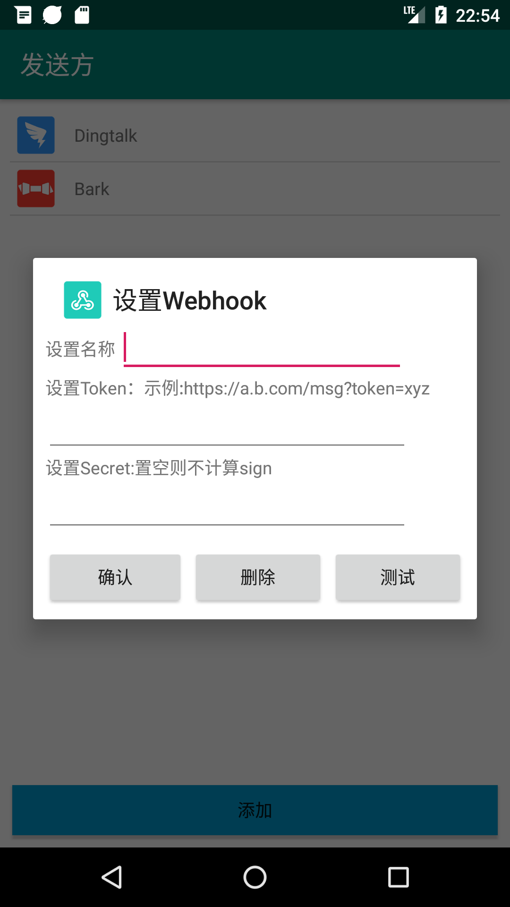
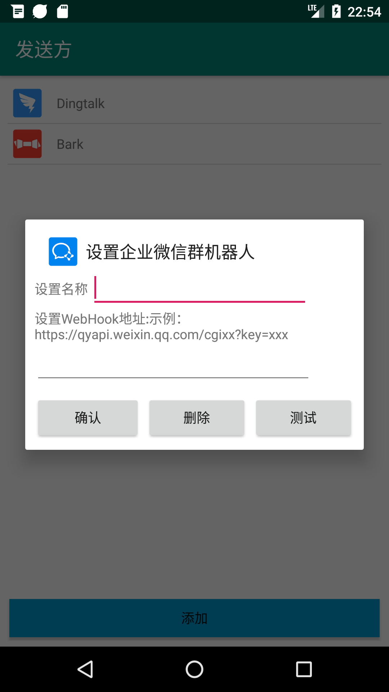
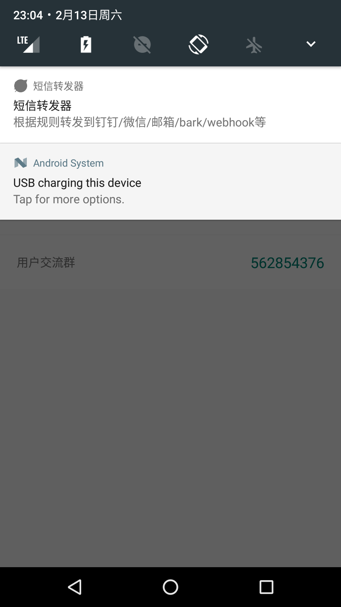
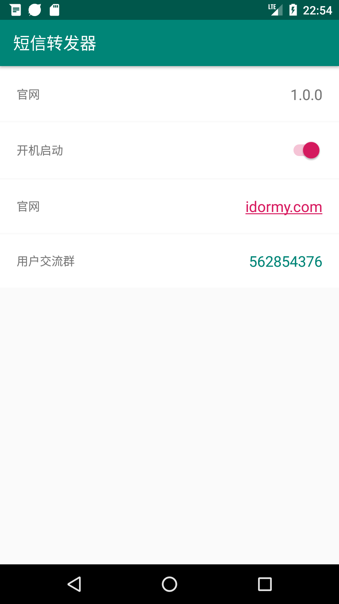
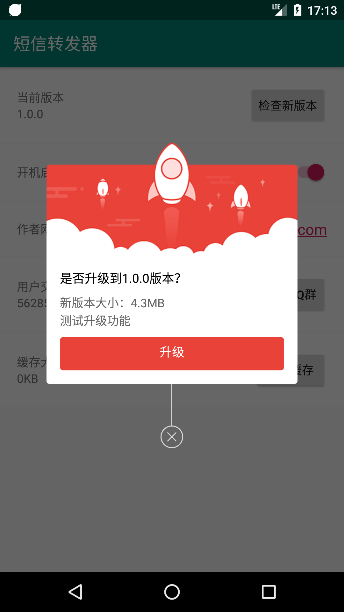

# SmsForwarder (短信转发器) 

Android手机监听短信并根据指定规则转发到其他手机、钉钉机器人、企业微信群机器人、邮箱、bark、webhook等

> ⚠ 此项目在 [xiaoyuanhost/TranspondSms](https://github.com/xiaoyuanhost/TranspondSms) 的基础上优化改造而来，感谢原作者!

--------

## 特别声明:

* 本仓库发布的`SmsForwarder`项目中涉及的任何代码/APK，仅用于测试和学习研究，禁止用于商业用途，不能保证其合法性，准确性，完整性和有效性，请根据情况自行判断。

* 本项目内所有资源文件，禁止任何公众号、自媒体进行任何形式的转载、发布。

* 间接使用代码/APK的任何用户，包括但不限于在某些行为违反国家/地区法律或相关法规的情况下进行传播, `pppscn` 对于由此引起的任何隐私泄漏或其他后果概不负责。

* 如果任何单位或个人认为该项目的代码/APK可能涉嫌侵犯其权利，则应及时通知并提供身份证明，所有权证明，我们将在收到认证文件后删除相关代码/APK。

--------

## 特点和准则：

* **简单** 只做两件事：监听短信 --> 根据指定规则转发

由此带来的好处：
* 简洁:（当时用Pad的时候，看手机验证码各种不方便，网上搜了好久也有解决方案）
> + AirDroid:手机管理工具功能太多，看着都耗电，权限太多，数据经过三方，账号分级
> + IFTTT:功能太多，看着耗电，权限太多，数据经过三方，收费
> + 还有一些其他的APP(例如：Tasker)也是这些毛病
* 省电：运行时只监听广播，有短信才执行转发，并记录最近n条的转发内容和转发状态
* 健壮：越简单越不会出错（UNIX设计哲学），就越少崩溃，运行越稳定持久

### 工作流程：
  

### 功能列表：
|  功能   | 描述  |
|  ----  | ----  |
| 转发监听  | 已实现 |
| 转发钉钉  | 单个钉钉群已实现 |
| 转发钉钉@某人  | 已实现 |
| 转发邮箱  | 单个邮箱已实现 |
| 转发Bark  | 已实现，验证码/动态密码自动复制 |
| 转发企业微信群机器人  | 已实现 |
| 转发web页面  | 单个web页面已实现（[向设置的url发送POST请求](doc/POST_WEB.md)） |
| 转发规则  | （规则即：什么短信转发到哪里）已实现 |
| 兼容  |  已兼容6.xx、7.xx、8.xx、9.xx、10.xx  |

### 使用流程：
1. 在Android手机上安装SmsForwarder 本APP后点击应用图标打开
2. 在设置发送方页面，添加或点击已添加的发送方来设置转发短信使用的方式，现在支持钉钉机器人、企业微信群机器人、邮箱、网页、Bark：
   + 设置钉钉机器人请先在钉钉群中添加自定义机器人，复制机器人的token和secret,填入弹出框。点击测试会使用该机器人向群内发送一条消息；点击确认即可添加配置。
   + 配置邮箱请先在你邮箱的后台管理页面配置smtp选项，并设置密码（授权码），并参照说明配置SmsForwarder弹出框的smtp信息。点击测试会使用该邮箱向配置的邮箱发送一条测试邮件；点击确认即可添加配置。
   + 配置网页通知请先在 msg.allmything.com 注册登陆并添加一个消息通道，复制消息通道token填入配置弹框。点击测试会向该消息通道推送一条测试消息，可在 msg.allmything.com 的消息页面查看（页面会自动刷新）；点击确认即可添加配置。
3. 在设置转发规则页面，添加或点击已添加的转发规则来设置转发什么样的短信，现在支持转发全部、根据手机号、根据短信内容：
   + 当设置转发全部时，所以接收到的短信都会用转发出去。
   + 当设置根据手机号或短信内容时，请设置匹配的模式和值，例如：”手机号 是 10086 发送方选钉钉“。
4. 点击主页面右上角的菜单可进入设置页面，在设置页面可以更新应用查看应用信息提交意见反馈等
5. 在主页面下拉可刷新转发的短信，点击清空记录可删除转发的记录

*注：该APP打开后会自动后台运行并在任务栏显示运行图标，请勿强杀，退出后请重新开启，并加入到系统白名单中，并允许后台运行*  

### 应用截图：

| | |
|  ----  | ----  |
|  |  |
|  |  |
|  |  |
|  |  |
|  |  |
|  |  |
|  |  |

--------

## 更新记录：

> [v1.1.2](app/release/SmsForwarder_release_20210218_1.1.2.apk) 获取系统(ROM)类别及版本号，MIUI通知栏显示标题

> [v1.1.1](app/release/SmsForwarder_release_20210215_1.1.1.apk) 更新应用/通知栏图标

> [v1.1.0](app/release/SmsForwarder_release_20210214_1.1.0.apk) 新增在线升级、缓存清理、加入QQ群功能

> [v1.0.0](app/release/SmsForwarder_release_20210213_1.0.0.apk) 优化后第一版

## LICENSE    
BSD
