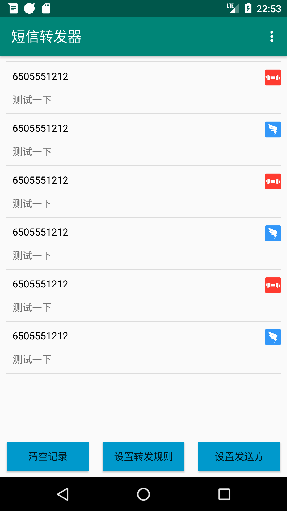
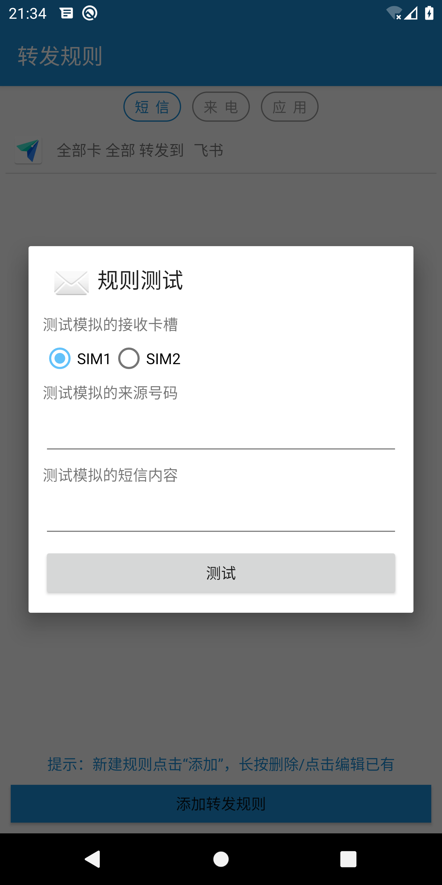
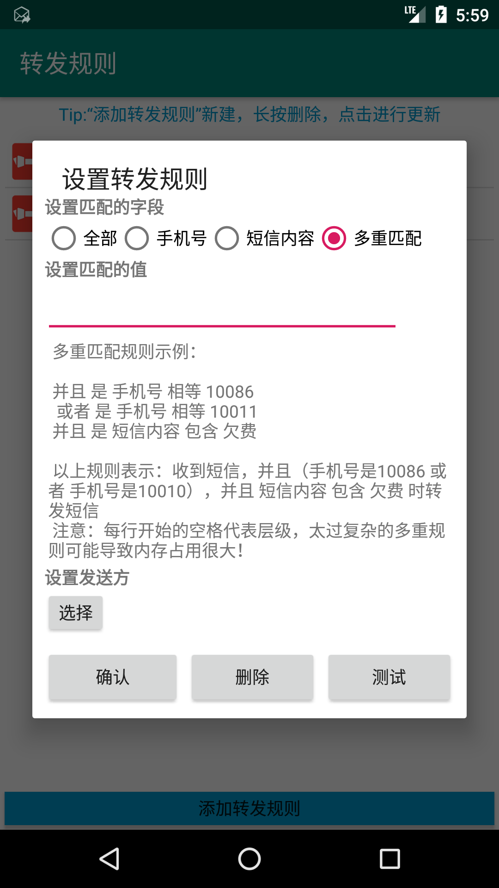
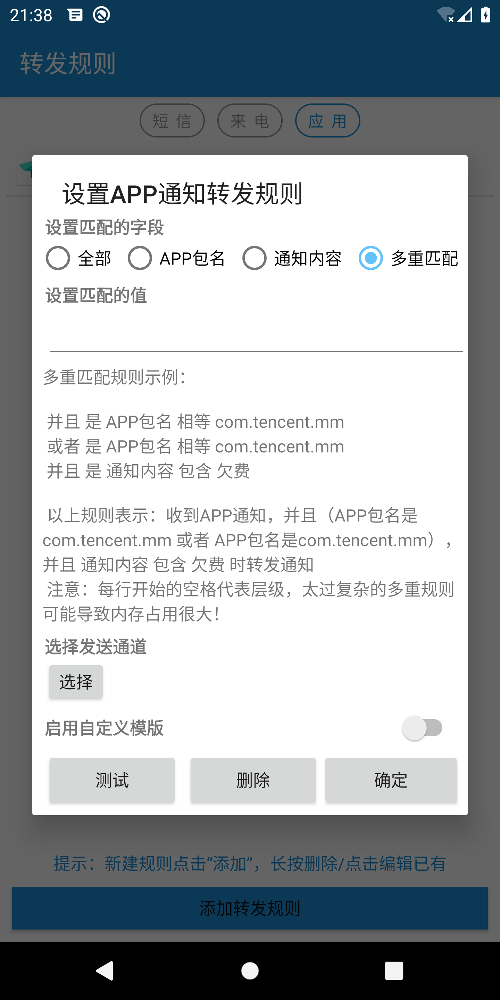
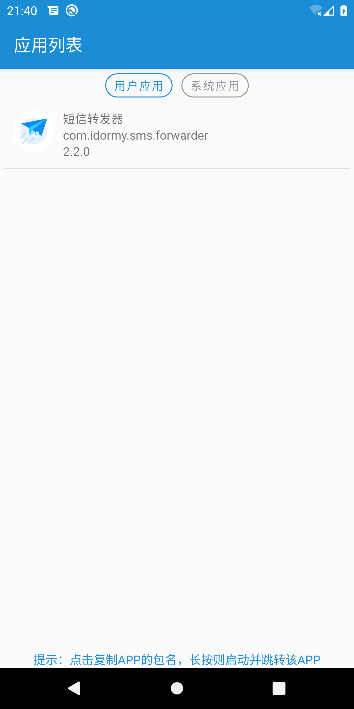

# SmsForwarder (短信转发器)

    

短信转发器——监控Android手机短信、来电、APP通知，并根据指定规则转发到其他手机：钉钉机器人、企业微信群机器人、飞书机器人、企业微信应用消息、邮箱、bark、webhook、Telegram机器人、Server酱、PushPlus、手机短信等。

### 下载地址

> ⚠ 首发地址：https://github.com/pppscn/SmsForwarder/releases

> ⚠ 国内镜像：https://gitee.com/pp/SmsForwarder/releases

> ⚠ 网盘下载：https://wws.lanzoui.com/b025yl86h 访问密码：`pppscn`

> ⚠ 酷安应用市场：https://www.coolapk.com/apk/com.idormy.sms.forwarder

### 使用文档

> ⚠ 首发地址：https://github.com/pppscn/SmsForwarder/wiki

> ⚠ 国内镜像：https://gitee.com/pp/SmsForwarder/wikis/pages

--------

## 特别声明:

* 本仓库发布的`SmsForwarder`项目中涉及的任何代码/APK，仅用于测试和学习研究，禁止用于商业用途，不能保证其合法性，准确性，完整性和有效性，请根据情况自行判断。

* 间接使用代码/APK的任何用户，包括但不限于在某些行为违反国家/地区法律或相关法规的情况下进行传播, `pppscn` 对于由此引起的任何隐私泄漏或其他后果概不负责。

* 如果任何单位或个人认为该项目的代码/APK可能涉嫌侵犯其权利，则应及时通知并提供身份证明，所有权证明，我们将在收到认证文件后删除相关代码/APK。

* 隐私声明：SmsForwarder 不会收集任何您的隐私数据！！！APP启动时发送版本信息发送到友盟统计；手动检查新版本时发送版本号用于检查新版本；除此之外，没有任何数据！！！

--------

## 特点和准则：

* **简单** 只做两件事：监听手机短信/来电/APP通知 --> 根据指定规则转发

由此带来的好处：

* 简洁:（当时用Pad的时候，看手机验证码各种不方便，网上搜了好久也有解决方案）
  > + AirDroid:手机管理工具功能太多，看着都耗电，权限太多，数据经过三方，账号分级
  > + IFTTT:功能太多，看着耗电，权限太多，数据经过三方，收费
  > + 还有一些其他的APP(例如：Tasker)也是这些毛病
* 省电：运行时只监听广播，有短信才执行转发，并记录最近n条的转发内容和转发状态
* 健壮：越简单越不会出错（UNIX设计哲学），就越少崩溃，运行越稳定持久

### 工作流程：

### 功能列表：

- [x] 监听短信，按规则转发（规则：什么短信内容/来源转发到哪里）
- [x] 转发到钉钉机器人（支持：单个钉钉群，@某人）
- [x] 转发到邮箱（支持：SMTP）
- [x] 转发到Bark（支持：验证码/动态密码自动复制）
- [x] 转发到webhook（支持：单个web页面（[向设置的url发送POST/GET请求](doc/POST_WEB.md)））
- [x] 转发到企业微信群机器人
- [x] 转发到企业微信应用消息
- [x] 转发到ServerChan(Server酱·Turbo版)
- [x] 转发到Telegram机器人（支持设置代理）
- [x] 转发到其他手机短信【注意：非免费的，转发短信运营商有收费的，建议没有网络时启用，并设置好内容过滤规则】
- [x] 在线检测新版本、升级
- [x] 清理缓存
- [x] 兼容 Android 5.xx 6.xx、7.xx、8.xx、9.xx、10.xx
- [x] 支持双卡手机，增加卡槽标识/运营商/手机号(如果能获取的话)
- [x] 支持多重匹配规则
- [x] 支持标注卡槽号码(优先使用)、设备信息；自定义转发信息模版
- [x] 支持正则匹配规则
- [x] 支持卡槽匹配规则
- [x] 转发未接来电提醒（固定sim1卡发出提醒）
- [x] 接口请求失败后延时重试5次（可配置间隔时间，成功一次则终止重试）
- [x] 转发到飞书机器人
- [x] 自定义 Scheme（forwarder://main）用于唤起App
- [x] 电池电量、状态变化预警
- [x] 多语言支持（目前：中文、英文）
- [x] 增加配置导出导入功能（一键克隆）
- [x] 监听其他APP通知信息并转发
- [x] 转发到PushPlus
- [x] 转发规则上允许自定义模板（留空则取全局设置）
- [x] 转发规则上支持配置正则替换内容

--------

### 应用截图：

| 前台服务常驻状态栏 | 应用主界面 | 转发规则 | 转发详情 |
|  ----  | ----  |  ----  | ----  |
|  |  |  |  |
| 添加/编辑转发规则测试 | 多重匹配规则 | 支持以下转发方式（发送通道） | 添加/编辑发送通道钉钉 |
|  |  |  |  |
| 添加/编辑发送通道邮箱 | 添加/编辑发送通道Bark | 添加/编辑发送通道网页通知 | 添加/编辑发送通道企业微信群机器人 |
|  |  |  |  |
| 添加/编辑发送通道Telegram机器人 | 添加/编辑发送通道Server酱·Turbo版 | 添加/编辑发送通道企业微信应用 | 应用设置 |
|  |  |  |  |
| 关于/在线升级 | 支持正则匹配规则 & 支持卡槽匹配规则 | 转发短信模板增加卡槽标识 | 添加/编辑发送通道其他手机短信 |
|  |  |  |  |
| 添加/编辑发送通道飞书机器人 | 增加配置导出导入功能（一键克隆） | 监听其他APP通知信息并转发 | 获取所有应用列表（方便复制APP包名）|
|  |  |  |  |

--------

## 反馈与建议：

+ 提交issues 或 pr
+ 加入交流群（群内都是机油互帮互助，禁止发任何与SmsForwarder使用无关的内容）

| 钉钉客户群 | QQ机油互助交流1群：562854376 | QQ机油互助交流2群：31330492 | 企业微信群 |
|  ----  |  ----  | ----  | ----  |
|  |  |  |  |

## 感谢

> 本项目得到以下项目的支持与帮助，在此表示衷心的感谢！

+ https://github.com/xiaoyuanhost/TranspondSms (基于此项目优化改造)
+ https://github.com/square/okhttp （网络请求）
+ https://github.com/xuexiangjys/XUpdateAPI （在线升级）
+ https://github.com/mailhu/emailkit （邮件发送）
+ https://github.com/alibaba/fastjson (Json解析)
+   (License Certificate for JetBrains All Products Pack)

--------

## 如果觉得本工具对您有所帮助，给个小星星鼓励一下！

--------

## LICENSE

BSD