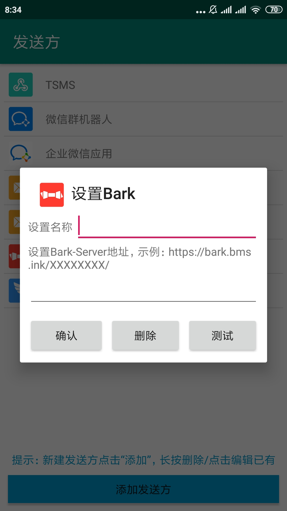

# SmsForwarder (短信转发器) 

监控Android手机短信并根据指定规则转发到其他手机：钉钉机器人、企业微信群机器人、企业微信应用消息、邮箱、bark、webhook、Telegram机器人、Server酱等。

> ⚠ 首发地址：https://github.com/pppscn/SmsForwarder

> ⚠ 同步镜像：https://gitee.com/pp/SmsForwarder

> ⚠ 网盘下载：https://wws.lanzous.com/b025yl86h 访问密码：`pppscn`

--------

## 特别声明:

* 本仓库发布的`SmsForwarder`项目中涉及的任何代码/APK，仅用于测试和学习研究，禁止用于商业用途，不能保证其合法性，准确性，完整性和有效性，请根据情况自行判断。

* 本项目内所有资源文件，禁止任何公众号、自媒体进行任何形式的转载、发布。

* 间接使用代码/APK的任何用户，包括但不限于在某些行为违反国家/地区法律或相关法规的情况下进行传播, `pppscn` 对于由此引起的任何隐私泄漏或其他后果概不负责。

* 如果任何单位或个人认为该项目的代码/APK可能涉嫌侵犯其权利，则应及时通知并提供身份证明，所有权证明，我们将在收到认证文件后删除相关代码/APK。

--------

## 特点和准则：

* **简单** 只做两件事：监听短信 --> 根据指定规则转发

由此带来的好处：
* 简洁:（当时用Pad的时候，看手机验证码各种不方便，网上搜了好久也有解决方案）
    > + AirDroid:手机管理工具功能太多，看着都耗电，权限太多，数据经过三方，账号分级
    > + IFTTT:功能太多，看着耗电，权限太多，数据经过三方，收费
    > + 还有一些其他的APP(例如：Tasker)也是这些毛病
* 省电：运行时只监听广播，有短信才执行转发，并记录最近n条的转发内容和转发状态
* 健壮：越简单越不会出错（UNIX设计哲学），就越少崩溃，运行越稳定持久

### 工作流程：
  

### 功能列表：

- [x] 监听短信，按规则转发（规则：什么短信内容/来源转发到哪里）
- [x] 转发到钉钉机器人（支持：单个钉钉群，@某人）
- [x] 转发到邮箱（支持：SMTP）
- [x] 转发到Bark（支持：验证码/动态密码自动复制）
- [x] 转发到webhook（支持：单个web页面（[向设置的url发送POST请求](doc/POST_WEB.md)））
- [x] 转发到企业微信群机器人
- [x] 转发到企业微信应用消息
- [x] 转发到ServerChan(Server酱·Turbo版)
- [x] 转发到Telegram机器人
- [x] 在线检测新版本、升级
- [x] 清理缓存
- [x] 兼容6.xx、7.xx、8.xx、9.xx、10.xx
- [x] 支持双卡手机，增加卡槽标识/运营商/手机号(如果能获取的话)
- [x] 支持多重匹配规则
- [x] 支持标注卡槽号码(优先使用)、设备信息；自定义转发信息模版
- [x] 支持正则匹配规则
- [x] 支持卡槽匹配规则
- [ ] 转发规则、发送方配置导出与导入

### 使用流程：
1. 在Android手机上安装SmsForwarder 本APP后点击应用图标打开
2. 在设置发送方页面，添加或点击已添加的发送方来设置转发短信使用的方式，现在支持钉钉机器人、企业微信群机器人、企业微信应用消息、邮箱、bark、webhook、Telegram机器人、Server酱：
   + 设置钉钉机器人请先在钉钉群中添加自定义机器人，复制机器人的token和secret,填入弹出框。点击测试会使用该机器人向群内发送一条消息；点击确认即可添加配置。
   + 配置邮箱请先在你邮箱的后台管理页面配置smtp选项，并设置密码（授权码），并参照说明配置SmsForwarder弹出框的smtp信息。点击测试会使用该邮箱向配置的邮箱发送一条测试邮件；点击确认即可添加配置。
   + 配置网页通知请先在 msg.allmything.com 注册登陆并添加一个消息通道，复制消息通道token填入配置弹框。点击测试会向该消息通道推送一条测试消息，可在 msg.allmything.com 的消息页面查看（页面会自动刷新）；点击确认即可添加配置。
3. 在设置转发规则页面，添加或点击已添加的转发规则来设置转发什么样的短信，现在支持转发全部、根据手机号、根据短信内容：
   + 当设置转发全部时，所以接收到的短信都会用转发出去。
   + 当设置根据手机号或短信内容时，请设置匹配的模式和值，例如：”手机号 是 10086 发送方选钉钉“。
4. 点击主页面右上角的菜单可进入设置页面，在设置页面可以更新应用查看应用信息提交意见反馈等
5. 在主页面下拉可刷新转发的短信，点击清空记录可删除转发的记录

> ⚠ 该APP打开后会自动后台运行并在任务栏显示运行图标，请勿强杀，退出后请重新开启，并加入到系统白名单中，并允许后台运行

> ⚠ 部分手机系统会限制第三方APP读取验证码类短信（例如：华为手机的短信保护），关闭后才能转发验证码类短信！

### 应用截图：

| | |
|  ----  | ----  |
| 前台服务常驻状态栏 | 应用主界面 |
|  |  |
| 转发规则 | 转发详情 |
|  |  |
| 添加/编辑转发规则测试 | 多重匹配规则 |
|  | |
| 支持以下转发方式（发送方） | 添加/编辑发送方钉钉 |
|  |  |
| 添加/编辑发送方邮箱 | 添加/编辑发送方Bark |
|  |  |
| 添加/编辑发送方网页通知 | 添加/编辑发送方企业微信群机器人 |
|  |  |
| 添加/编辑发送方Telegram机器人 | 添加/编辑发送方Server酱·Turbo版 |
|  |  |
| 添加/编辑发送方企业微信应用 | 应用设置 |
|  |  |
| 关于/在线升级 | 支持正则匹配规则 & 支持卡槽匹配规则 |
|  |  |
| 转发短信模板增加卡槽标识 |  |
|  | |

--------

## 更新记录：（PS.点击版本号下载对应的版本）

+ [v1.0.0](app/release/SmsForwarder_release_20210213_1.0.0.apk) 优化后第一版
+ [v1.1.0](app/release/SmsForwarder_release_20210214_1.1.0.apk) 新增在线升级、缓存清理、加入QQ群功能
    + [v1.1.1](app/release/SmsForwarder_release_20210215_1.1.1.apk) 更新应用/通知栏图标
    + [v1.1.2](app/release/SmsForwarder_release_20210218_1.1.2.apk) 获取系统(ROM)类别及版本号，MIUI通知栏显示标题
    + [v1.1.3](app/release/SmsForwarder_release_20210218_1.1.3.apk) AlertDialog增加滚动条，避免参数过长时无法点击按钮
+ [v1.2.0](app/release/SmsForwarder_release_20210219_1.2.0.apk) 重写SMTP邮件发送（推荐升级）
    + [v1.2.1](app/release/SmsForwarder_release_20210226_1.2.1.apk) 修复bark-server升级到2.0后的兼容性问题
    + [v1.2.2](app/release/SmsForwarder_release_20210302_1.2.2.apk) 【预发布】短信模板增加卡槽标识（SIM1_中国联通_Unknown 或 SIM2_中国移动_+8615866666666）
    + [v1.2.3](app/release/SmsForwarder_release_20210302_1.2.3.apk) 【预发布】转发日志列表/详情增加卡槽标识（SIM1 或 SIM2）
+ [v1.3.0](app/release/SmsForwarder_release_20210303_1.3.0.apk) 支持双卡手机，增加卡槽标识/运营商/手机号(如果能获取的话)
+ [v1.4.0](app/release/SmsForwarder_release_20210304_1.4.0.apk) 支持多重匹配规则
    + [v1.4.1](app/release/SmsForwarder_release_20210304_1.4.1.apk) 设置中允许关闭页面帮助/表单填写提示
+ [v1.5.0](app/release/SmsForwarder_release_20210305_1.5.0.apk) 新增转发到企业微信应用消息
    + [v1.5.1](app/release/SmsForwarder_release_20210310_1.5.1.apk) 解决Android 9.xx、10.xx收不到广播问题
    + [v1.5.2](app/release/SmsForwarder_release_20210311_1.5.2.apk) 支持标注卡槽号码(优先使用)、设备信息；自定义转发信息模版
+ [v1.6.0](app/release/SmsForwarder_release_20210312_1.6.0.apk) 优化获取SIM信息（兼容高版本Android） & 自动填写设备备注 & 自动填充卡槽信息到SIM1备注/SIM2备注 & 支持卡槽匹配规则 & 支持正则匹配规则
    + [v1.6.1](app/release/SmsForwarder_release_20210312_1.6.1.apk) 新增转发到Server酱·Turbo版
    + [v1.6.2](app/release/SmsForwarder_release_20210312_1.6.2.apk) 新增转发到Telegram机器人

--------

## 反馈与建议：

+ 提交issues 或 pr
+ 加入交流群

| | |
|  ----  | ----  |
| QQ交流群：562854376 | 微信交流群 |
|  |  |

## 感谢

> 本项目使用(或借鉴)了以下项目(或部分代码)，在此表示衷心的感谢！

+ https://github.com/xiaoyuanhost/TranspondSms (基于此项目优化改造)
+ https://github.com/square/okhttp （网络请求）
+ https://github.com/xuexiangjys/XUpdateAPI （在线升级）
+ https://github.com/mailhu/emailkit （邮件发送）
+ https://github.com/alibaba/fastjson (Json解析)

## LICENSE    
BSD
