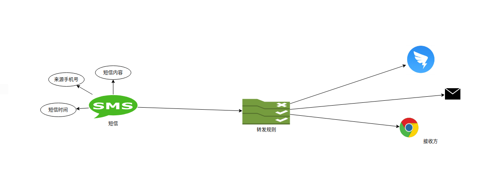
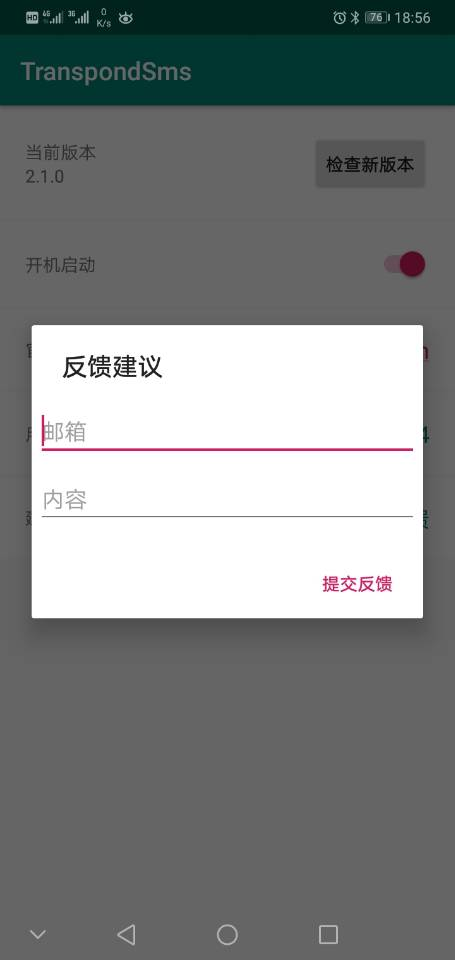
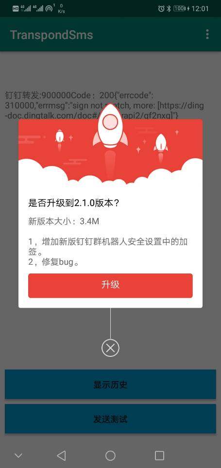

# 短信转发 信息转发 TranspondSms， 把Android手动的短信通过邮件或者钉钉转出去

博文连接[https://www.jianshu.com/p/608d1b1477e3]  
官网[https://tsms.allmything.com]  
APP下载 [https://pan.baidu.com/s/1kbelTFIf5nwkOY9g6itkvA]

--------
## 该工具实现特点和准则：
* **简单** 只做两件事：监听短信---》转发

由此带来的好处：
* 功能简单:（当时用Pad的时候，看手机验证码各种不方便，网上搜了好久也有解决方案）
> + AirDroid:手机管理工具功能太多，看着都耗电，权限太多，数据经过三方，账号分级
> + IFTTT:功能太多，看着耗电，权限太多，数据经过三方，收费
> + 还有些其他的也是这些毛病
* 省电：运行时只监听广播，有短信才执行转发，并记录最近n条的转发内容和转发状态
* 健壮：越简单越不会出错（UNIX设计哲学），就越少崩溃，运行越稳定持久

### 工作流程：
  

### 功能列表：
|  功能   | 描述  |
|  ----  | ----  |
| 转发监听  | 已实现 |
| 转发钉钉  | 单个钉钉群已实现 |
| 转发钉钉@某人  | 已实现 |
| 转发邮箱  | 单个邮箱已实现 |
| 转发企业微信群机器人  | 已实现 |
| 转发web页面  | 单个web页面已实现（[向设置的url发送POST请求](doc/POST_WEB.md)） |
| 转发规则  | （规则即：什么短信转发到哪里）已实现实现 |
| 兼容  |  已兼容6.xx、7.xx、8.xx、9.xx、10.xx  |

### 使用流程：
1. 在Android手机上安装TSMS 本APP后点击应用图标打开
2. 在设置发送方页面，添加或点击已添加的发送方来设置转发短信使用的方式，现在支持钉钉机器人、邮箱、网页：
   + 设置钉钉机器人请先在钉钉群中添加自定义机器人，复制机器人的token和secret,填入弹出框。点击测试会使用该机器人向群内发送一条消息；点击确认即可添加配置。
   + 配置邮箱请先在你邮箱的后台管理页面配置smtp选项，并设置密码（授权码），并参照说明配置TSMS弹出框的smtp信息。点击测试会使用该邮箱向配置的邮箱发送一条测试邮件；点击确认即可添加配置。
   + 配置网页通知请先在 msg.allmything.com 注册登陆并添加一个消息通道，复制消息通道token填入配置弹框。点击测试会向该消息通道推送一条测试消息，可在 msg.allmything.com 的消息页面查看（页面会自动刷新）；点击确认即可添加配置。
3. 在设置转发规则页面，添加或点击已添加的转发规则来设置转发什么样的短信，现在支持转发全部、根据手机号、根据短信内容：
   + 当设置转发全部时，所以接收到的短信都会用转发出去。
   + 当设置根据手机号或短信内容时，请设置匹配的模式和值，例如：”手机号 是 10086 发送方选钉钉“。
4. 点击主页面右上角的菜单可进入设置页面，在设置页面可以更新应用查看应用信息提交意见反馈等
5. 在主页面下拉可刷新转发的短信，点击清空记录可删除转发的记录

*注：该APP打开后会自动后台运行并在任务栏显示运行图标，请勿强杀，退出后请重新开启，并加入到系统白名单中，并允许后台运行*  

### 应用截图：

### 更新记录：
> [v3.5.0](app/release/TSMS_release_20210126_3.5.0.apk) 1，钉钉机器人添加 @ 功能

> [v3.4.0](pic/TSMS_release_20210120_3.4.0.apk) 1，增加企业微信群机器人通知。2，修复设置开机启动崩溃

> [v3.3.0](pic/TSMS_release_20210113_3.3.0.apk) 1，增加网页通知验签。2，修复网页及钉钉配置测试崩溃

> [v3.2.0](pic/TSMS_release_20210106_3.2.0.apk) 1，增加邮箱SSL配置。2，邮箱测试结果通知

> [v3.1.0](pic/TSMS_release_20201231_3.1.0.apk) 1，界面重构。2，增加转发规则页面。3，增加发送方页面。4，升级配置页面

> [v2.1.0](pic/TSMS_release_20200806_2.1.0.apk) 1，增加新版钉钉群机器人安全设置中的加签

> [v2.00](pic/TSMS_release_20200729_2.00.apk) 1，移除热点管理，回归简单。2，修复Android9，Android10版本闪退。3，添加更新接口。4，修复bug

> v1.1 减少手动配置启动参数：自启动配置、自动开启热点配置（设置好后手机重启也不用重新打开了，还能自动为pad开启热点）
<u>热点管理
可设置跟随设备启动时启动热点，并且在热点关闭后10秒自动重启热点（所以想关闭热点先把设置页码的开启热点关掉）</u>
(热点助手功能会在后期2020/07/29转移到单独的APP)详见[https://www.jianshu.com/p/f70cf475eddc]

> v1.0 项目初始化，实现转发

## LICENSE    
BSD
