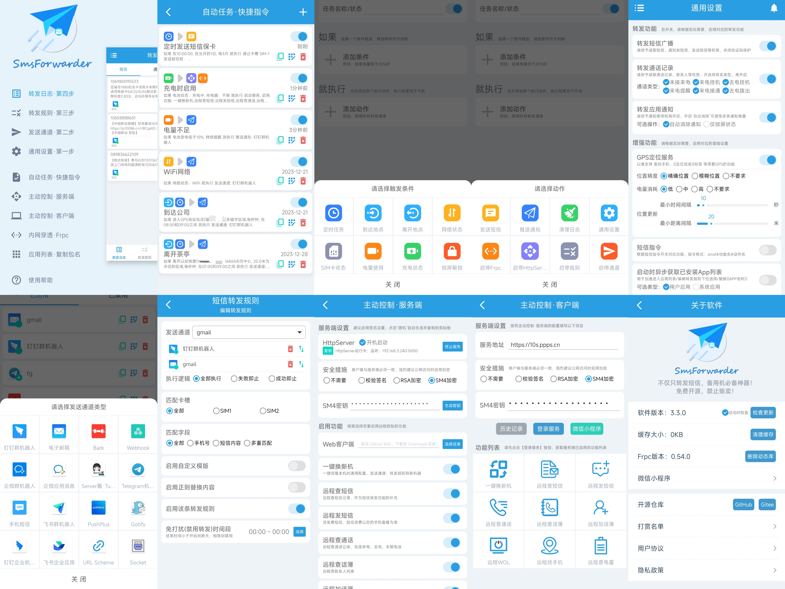
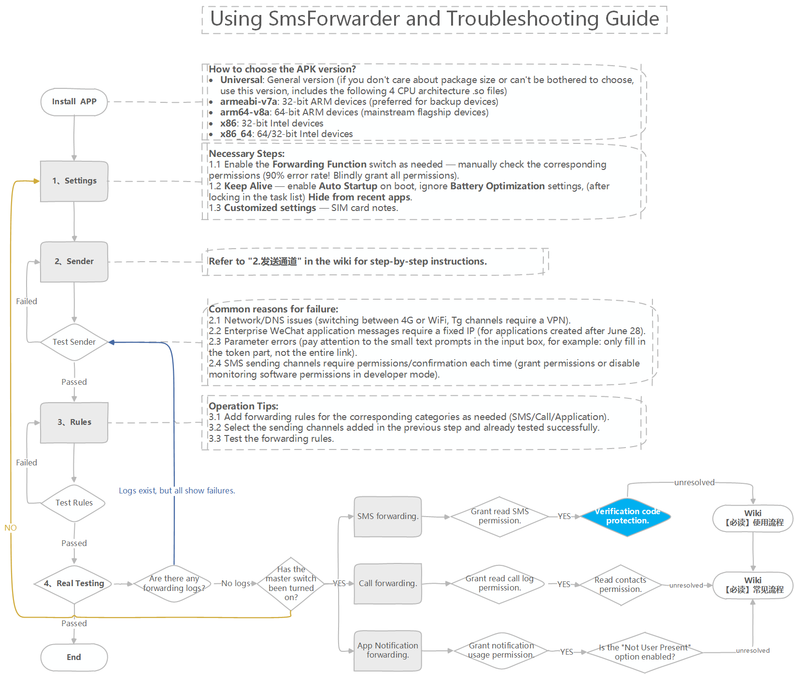

# SmsForwarder

[中文版](README.md)

    

--------

SmsForwarder - Not only forwarding text messages, but also a must-have for backup devices!

listens to SMS, incoming calls, and App notifications on Android mobile devices, and forward according to user defined rules to another App/device, including DingTalk, WeCom and WeCom Group Bot, Feishu App and Feishu Group Bot, E-mail, Bark, Webhook, Telegram Bot, ServerChan, PushPlus, SMS, etc.

Including active control of the server and client, allowing you to easily and remotely send text messages, check text messages, check calls, check the phone book, check the battery, etc. (New in v3.0+)

Automated Tasks & Quick Commands, effortlessly automate your life, doubling your efficiency, leaving more time to cherish family bonds! (New in v3.3+)

> Notice: Starting from `2022-06-06`, the original `Java edition` code has been archived to the `v2.x` branch and will no longer be updated!

> `v3.x` is compatible with Android 4.4 ~ 13.0.

>  `Join the SmsF Preview Program` (online weekly build updates, be the first to experience new versions & bug fixes).

**Upgrade Instructions:**
- After joining the SmsF Preview Experience Program, update online (available from `About Software` page, applicable for `v3.3.0_240305+`).
- Manual download: [https://github.com/pppscn/SmsForwarder/actions/workflows/Weekly_Build.yml](https://github.com/pppscn/SmsForwarder/actions/workflows/Weekly_Build.yml)

--------

## NOTE

* Any code/APK of `SmsForwarder` related to the this repository is for test, study, and research only, commercial use is **prohibited**. Legality, accuracy, completeness and validity of any code/APK of this repo is guaranteed by **NOBODY**, and shall only be determined by User.

* `pppscn` and/or any other Contributor to this repo is **NOT** responsible for any consequences (including but not limited to privacy leakage) arising from any user's direct or indirect use or dissemination of any code or APK of `SmsForwarder`, regardless of whether such use is in accordance with the laws of the country or territory where such user locates or such use or dissemination occurs.

* Should any entity finds the code/APK of this repo infringing their rights, please provide notice and identity and proprietorship document, and we will delete relating code/APK after examining such document.

* Privacy: `SmsForwarder` collects absolutely **NO** any of your personal data!! Except 1) version information to umeng.com for stats as the App starts, and 2) version number when manually check for update, `SmsForwarder` is **NOT** sending any data without users' knowledge.

--------

## Workflow:

--------

## Screenshots :

See more screenshots：https://github.com/pppscn/SmsForwarder/wiki

--------

## Download

> ⚠ Repo address: https://github.com/pppscn/SmsForwarder/releases

> ⚠ Repo mirror in China: https://gitee.com/pp/SmsForwarder/releases

> ⚠ Internet storage: https://wws.lanzoui.com/b025yl86h, access password: `pppscn`

## Manual

> ⚠ GitHub: https://github.com/pppscn/SmsForwarder/wiki

> ⚠ Gitee: https://gitee.com/pp/SmsForwarder/wikis/pages

--------

## Feedback and suggestions:

+ Submit an issue or Pull Request.
+ Join group chat (only Chinese groups/channels available currently)

|                   Telegram Group                    |
|:---------------------------------------------------:|
|       |
| [+QBZgnL_fxYM0NjE9](https://t.me/+QBZgnL_fxYM0NjE9) |

## Acknowledgements

> [Thanks to all the enthusiastic netizens who sponsored this project --> Reward list](https://gitee.com/pp/SmsForwarder/wikis/pages?sort_id=4912193&doc_id=1821427)

> Thanks to the projects below, `SmsForwarder` won't exists without them!

+ https://github.com/xiaoyuanhost/TranspondSms (Foundation of `SmsForwarder`)
+ https://github.com/xuexiangjys/XUI （UI Framework）
+ https://github.com/xuexiangjys/XUpdate (online update)
+ https://github.com/getActivity/XXPermissions (permission requiring)
+ https://github.com/mainfunx/frpc_android (reverse proxy)
+ https://github.com/gyf-dev/Cactus (Keep Alive)
+ https://github.com/yanzhenjie/AndServer (HttpServer)
+ https://github.com/jenly1314/Location (Location)
+ https://gitee.com/xuankaicat/kmnkt (socket)
+   (License Certificate for JetBrains All Products Pack)

--------

## Star this repo if you find this application useful!

<a href="https://star-history.com/#pppscn/SmsForwarder&Date">
  <picture>
    <source media="(prefers-color-scheme: dark)" srcset="https://api.star-history.com/svg?repos=pppscn/SmsForwarder&type=Date&theme=dark" />
    <source media="(prefers-color-scheme: light)" srcset="https://api.star-history.com/svg?repos=pppscn/SmsForwarder&type=Date" />
    
  </picture>
</a>

--------

## LICENSE

BSD
